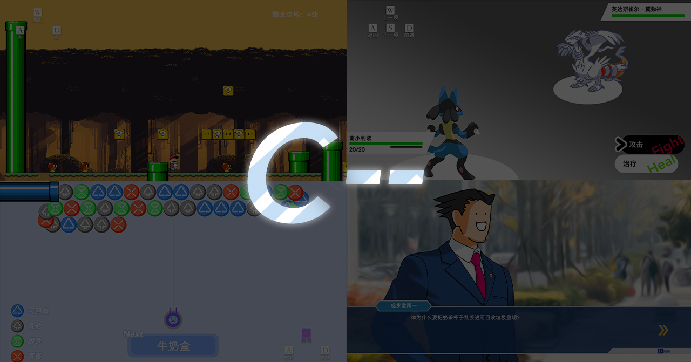

# C--


A Java game composed of 4 mini games written for a programming design contest during 2021.04~06, whose theme is carbon neutrality.


## 1. 简介

本游戏为**2021年南京大学软件学院EL程序设计大赛交互组**参赛作品，主题为**碳中和**。

于**2021年3月17日**立项，同年**5月23日**发布1.0版本。

本游戏主要内容分为4个部分，分别为：

1. 拯救沙中绿
2. 污染肃清
3. Wake Up Everyone！
4. 什么？垃圾！

我们在这四个部分中根据碳中和原理与国家相关政策分别设计了不同的任务，以此让玩家在游玩的过程中对碳中和有进一步了解，潜移默化地向大众普及碳中和知识。


## 1.1 实现

最终作品完全由 **Java** 编写，图形界面由 **Java Swing** 实现。所用贴图素材未直接使用现成素材，但有参考实际游戏素材；由于开发时间有限，并未制作背景音乐及声效。


## 2. Build & Run

The game is built by Maven. You can simply build it by typing:

```shell
path/to/root> mvn package
```

And the product is `jar` file. Hence you can run it by typing:

```shell
path/of/jar> java -jar C--.jar
```

The game is tested to run smoothly on macOS, and run successfully but with performance issue on Ubuntu and Windows 10 (11 is not tested).


## 3. 创意来源

#### Part 1 拯救沙中绿 

- 游戏模式及美工借鉴自 ***Super Mario World (Nintendo, 1990)***。

#### Part 2 污染肃清

- 游戏模式及 UI 借鉴自 ***Pokémon Sword/Shield (Game Freak, 2019)***。
- 借鉴宝可梦形象有*路卡利欧*、*雷希拉姆*、*捷克罗姆*、*酋雷姆*。

#### Part 3 Wake Up Everyone!

- 游戏模式及人物、UI 等借鉴自***逆伝裁判 (Capcom, 2001)***。
- 借鉴人物形象为*成步堂龙一*、*御剑怜寺*、*亚内武文*、*狩魔豪*

#### Part 4 什么？垃圾！

- 2D定点射击游戏，美工为原创。

